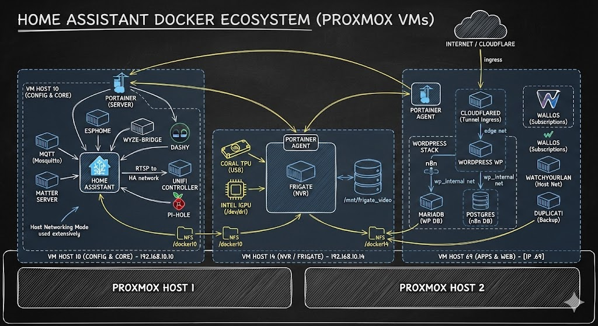

<h1 align="center">
  
   
  Bear Stone Smart Home Documentation
</h1>
<h4 align="center">Be sure to :star: my configuration repo so you can keep up to date on any daily progress!</h4>

  

Live, personal Home Assistant configuration shared for **browsing and inspiration**. This is not a turnkey clone-and-run setup; borrow ideas, adapt entity IDs/secrets, and test in your own environment.

### Quick navigation
- You are here: `/` (root repo guide)
- [Blog](https://www.vcloudinfo.com) | [Issues](https://github.com/CCOSTAN/Home-AssistantConfig/issues?q=is%3Aissue+is%3Aopen+sort%3Aupdated-desc) | [Diagram](config/www/custom_ui/floorplan/images/branding/Bear-Stone-Docker-Diagram.jpg) | [YouTube](https://youtube.com/vCloudInfo)
- Config readmes: [Config index](config/README.md) | [Packages](config/packages/README.md) | [Automations](config/automation/README.md) | [Scripts](config/script/README.md) | [Scenes](config/scene/README.md) | [Sounds](config/sounds/README.md) | [Package triggers](config/packages/triggers/README.md)
- Codex skills (optional): [codex_skills](codex_skills)

### What this repo is (and isn't)
- A live record of how my smart home runs, with real-world automations, scripts, and scenes.
- A place to reverse-engineer patterns, not a deployment guide. If you reuse snippets, adjust entities, secrets, and services to fit your setup.
- Issues double as a changelog and design history; browse them for rationale behind changes.

### Repo layout and files you won't see
- Reusable config lives under `config/` (see the quick navigation paths above).
- Runtime artifacts are hidden by `.gitignore` and won't show up on GitHub (e.g., `home-assistant_v2.db*`, logs, `deps/`, `.venv/`, backups). Look at the YAML and scripts for the actual logic and regenerate your own `secrets.yaml`.

### Platform
- Runs on Docker/compose today; this README is a browsing guide, not a how-to-install. Current HA version is tracked in `config/.HA_VERSION` (see the badge above).
- Camera ingest path (current): `wyze-bridge` runs on `docker_10` and Frigate runs on `docker_14`, consuming Wyze RTSP via `192.168.10.10:8554` for stability.

### Featured examples to start with
- Alarm and perimeter monitoring: [config/packages/alarm.yaml](config/packages/alarm.yaml)
- Garage routines and entry lighting: [config/packages/garadget.yaml](config/packages/garadget.yaml), [config/automation/garage_entry_light.yaml](config/automation/garage_entry_light.yaml)
- Holiday/front-of-house color scenes: [config/scene/monthly_colors.yaml](config/scene/monthly_colors.yaml), [config/script/monthly_color_scene.yaml](config/script/monthly_color_scene.yaml)
- Dash-button triggers for quick actions: [config/automation/dash_buttons.yaml](config/automation/dash_buttons.yaml)
- PC lock/unlock-driven lighting via HASS.Agent: [config/packages/hass_agent_homepc.yaml](config/packages/hass_agent_homepc.yaml)
- Seasonal cuckoo clock with October and Christmas sound packs: [config/automation/System/CucKoo_Clock.yaml](config/automation/System/CucKoo_Clock.yaml)
- Garage arrival and entry helpers: [config/packages/garadget.yaml](config/packages/garadget.yaml)
- Battery and solar awareness: [config/packages/powerwall.yaml](config/packages/powerwall.yaml)
- Presence-aware office comfort: [config/packages/office_motion.yaml](config/packages/office_motion.yaml)
- Weather-aware lighting: [config/automation/dark_rainy_day.yaml](config/automation/dark_rainy_day.yaml)

### Network diagram

**Docker add-ons & utilities**
| Container | Repo/Docs | Purpose |
| --- | --- | --- |
| Home Assistant Time Machine | [saihgupr/HomeAssistantTimeMachine](https://github.com/saihgupr/HomeAssistantTimeMachine) | Browse/diff/restore HA YAML (Lovelace, automations, scripts, ESPHome, packages) against existing backups. Blog walkthrough: [Time Machine for dashboards](https://www.vcloudinfo.com/2025/12/home-assistant-time-machine-dashboards.html). |
| Duplicati | [duplicati/duplicati](https://github.com/duplicati/duplicati) | Off-box, versioned backups for HA config and media; docker config backups land in OneDrive. |
| Dozzle | [amir20/dozzle](https://github.com/amir20/dozzle) | Lightweight Docker log viewer (useful for quick tailing across the homelab stacks). |
| Cloudflared | [cloudflare/cloudflared](https://hub.docker.com/r/cloudflare/cloudflared) | Secure tunnel/edge access to Home Assistant without opening inbound ports. |
| WordPress | [wordpress](https://hub.docker.com/_/wordpress) | Hosts [vCloudInfo.com](https://www.vcloudinfo.com) for docs, how-tos, videos, and long-form writeups that accompany this config. |

### Gear tied to real automations (affiliate links)
Only listing hardware that appears in active packages/automations here.
https://amzn.to/48jVzZ3
| Device | What it drives (friendly name -> file) | Buy |
| --- | --- | --- |
| Garadget garage door controller | Garage doors: open/close, reflection alerts - [garadget package](config/packages/garadget.yaml) |  |
| August smart lock | Front-door lock control + status - [august package](config/packages/august.yaml) |  |
| Phyn Plus water shutoff | Leak detection + auto shutoff - [phynplus package](config/packages/phynplus.yaml) |  |
| Rachio sprinkler controller | Rain-skips and seasonal watering - [rachio package](config/packages/rachio.yaml) |  |
| Tesla Powerwall 2 | Grid-outage alerts + load-shed automations - [powerwall package](config/packages/powerwall.yaml) |  |
| NodeMCU motion sensor | Office motion lighting - [office_motion package](config/packages/office_motion.yaml) |  |
| Raspberry Pi 3 + Aeon Z-Wave stick | Z-Wave backbone for door/hall sensors - [garage entry helper](config/automation/garage_entry_light.yaml) |   |
| Roku streaming device | TV presence -> scenes/lighting - [roku package](config/packages/roku.yaml) |  |
| Amazon Dash Button | Quick actions (office lamp toggle) - [dash buttons automation](config/automation/dash_buttons.yaml) |  |
| Amazon Echo Show | Front door camera pop-up when the August lock unlocks - [august package](config/packages/august.yaml) |  |
| Dreame/Neato vacuum | Cleaning schedules + notifications - [vacuum package](config/packages/vacuum.yaml) |  |
| Flux/LED strip controller | Monthly color scenes for exterior - [monthly color scene](config/script/monthly_color_scene.yaml) |  |
| Etekcity/433MHz outlet | Accent lighting relays - [garage entry helper](config/automation/garage_entry_light.yaml) |  |

### Gear and affiliate links
- Browsing or purchasing through the affiliate links above helps support this project; thanks!
- Full gear list: https://www.vcloudinfo.com/gear-list

**All of my configuration files are tested against the most stable version of home-assistant.**

**Still have questions on my Config?**  
**Message me on X :** 

<a target="_blank" href="https://www.buymeacoffee.com/vCloudInfo">You can buy me a coffee</a>
 
 
<a href="https://www.vCloudInfo.com/p/affiliate-disclosure.html">
Affiliate Disclosure
</a>

