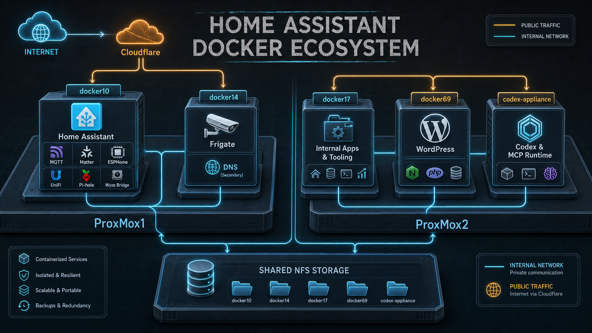

<h1 align="center">
  
   
  Bear Stone Smart Home Documentation
</h1>
<h4 align="center">Be sure to :star: my configuration repo so you can keep up to date on any daily progress!</h4>

  

Live, personal Home Assistant configuration shared for **browsing and inspiration**. This is not a turnkey clone-and-run setup; borrow ideas, adapt entity IDs/secrets, and test in your own environment.

### Latest video: Tracking Air Quality in Home Assistant

The speech briefing compares Airly's nearest-monitor CAQI with Pirate Weather's US EPA AQI without averaging the two scales. Normal air stays silent; only an abnormal reading adds a calm, useful warning to the announcement.  . Browse  and [issue #1834](https://github.com/CCOSTAN/Home-AssistantConfig/issues/1834) for the implementation notes.

### Quick navigation
- You are here: `/` (root repo guide)
- [Blog](https://www.vcloudinfo.com) | [Issues](https://github.com/CCOSTAN/Home-AssistantConfig/issues?q=is%3Aissue+is%3Aopen+sort%3Aupdated-desc) | [Diagram](#network-diagram) | [YouTube](https://youtube.com/vCloudInfo)
- Config readmes: [Config index](config/README.md) | [Packages](config/packages/README.md) | [Automations](config/automation/README.md) | [Scripts](config/script/README.md) | [Scenes](config/scene/README.md) | [Sounds](config/sounds/README.md) | [Package triggers](config/packages/triggers/README.md)
- Codex skills (optional): [Home Assistant Codex Skills](https://github.com/CCOSTAN/Home-Assistant-Codex-Skills)

### What this repo is (and isn't)
- A live record of how my smart home runs, with real-world automations, scripts, and scenes.
- A place to reverse-engineer patterns, not a deployment guide. If you reuse snippets, adjust entities, secrets, and services to fit your setup.
- Issues double as a changelog and design history; browse them for rationale behind changes.

### Repo layout and files you won't see
- Reusable config lives under `config/` (see the quick navigation paths above).
- Runtime artifacts are hidden by `.gitignore` and won't show up on GitHub (e.g., `home-assistant_v2.db*`, logs, `deps/`, `.venv/`, backups). Look at the YAML and scripts for the actual logic and regenerate your own `secrets.yaml`.

### Platform
- Runs on Docker/compose today; this README is a browsing guide, not a how-to-install. Current HA version is tracked in `config/.HA_VERSION` (see the badge above).
- Camera ingest path (current): `wyze-bridge` runs on `docker_10` and Frigate runs on `docker_14`, consuming Wyze RTSP via `192.168.10.10:8554` for stability.

### Featured examples to start with
- Alarm and perimeter monitoring: 
- Garage routines and entry lighting: , , 
- LLM Vision package reminders: , 
- Docker update reporting and exception review: , [config/dashboards/infrastructure](config/dashboards/infrastructure), , 
- Entity registry and Docker telemetry cleanup: , , [recorder](config/recorder.yaml), [logbook](config/logbook.yaml), , 
- Codex reset-credit tracking: , [config/dashboards/infrastructure](config/dashboards/infrastructure), 
- TeslaMate road-trip reports and milestone alerts: , [issue #1845](https://github.com/CCOSTAN/Home-AssistantConfig/issues/1845), , 
- Air-quality speech alerts with separate CAQI and US AQI thresholds: , [issue #1834](https://github.com/CCOSTAN/Home-AssistantConfig/issues/1834), , 
- Water leak response loop: , 
- Water softener salt maintenance: , , , , , [issue #1816](https://github.com/CCOSTAN/Home-AssistantConfig/issues/1816)
- Sprinkler status and last-run dashboard: , , , , 
- Bedroom camera kiosk tablet: , [config/dashboards/kiosk](config/dashboards/kiosk), 
- Holiday/front-of-house color scenes: , 
- Dash-button triggers for quick actions: 
- PC lock/unlock-driven lighting plus workday wake-up via HASS.Agent + Wake on LAN: 
- Seasonal cuckoo clock with patriotic, October, and Christmas sound packs: 
- Garage arrival and entry helpers: 
- Vacation Mode and house-sitter checks: 
- HVAC runtime maintenance loop: , , 
- Snoozeable maintenance notifications: , , , 
- Battery and solar awareness: , , 
- Presence-aware office comfort: 
- Weather-aware lighting: 

### Network diagram

Editable topology source: [Mermaid](docs/diagrams/bear-stone-proxmox-docker-topology.mmd) and [notes](docs/diagrams/bear-stone-proxmox-docker-topology.md).

**Docker add-ons & utilities**
| Container | Repo/Docs | Purpose |
| --- | --- | --- |
| Duplicati | [duplicati/duplicati](https://github.com/duplicati/duplicati) | Off-box, versioned backups for HA config, media, and infrastructure compose/config trees. |
| Cloudflared | [cloudflare/cloudflared](https://hub.docker.com/r/cloudflare/cloudflared) | Secure tunnel/edge access to Home Assistant without opening inbound ports. |
| WordPress | [wordpress](https://hub.docker.com/_/wordpress) | Hosts [vCloudInfo.com](https://www.vcloudinfo.com) for docs, how-tos, videos, and long-form writeups that accompany this config. |

### Gear tied to real automations (affiliate links)
Only listing hardware that appears in active packages/automations or has an open implementation issue here.
https://amzn.to/48jVzZ3
| Device | What it drives (friendly name -> file) | Buy |
| --- | --- | --- |
| Amazon Fire tablet wall kiosk | Bedroom camera screen with Fully Kiosk recovery, bedtime dimming, and a dedicated YAML dashboard - , [kiosk dashboard](config/dashboards/kiosk),  |   |
| Garadget garage door controller | Garage doors: open/close, arrival helpers, wind alerts, and nighttime reminders - , ,  |  |
| August smart lock | Front-door lock control + status -  |  |
| Phyn Plus water shutoff | Leak detection + auto shutoff - , , ,  |  |
| Rachio sprinkler controller | Rain-skips, active-zone status, trigger-derived last-run history, and dashboard controls - , , , ,  |  |
| Tesla Powerwall 2 | Grid-outage alerts, charging watchdog, and load-shed automations - , ,  |  |
| Google Nest thermostat | HVAC schedules plus runtime-based filter reminders and condenser-line cleanout tracking - , ,  |  |
| NodeMCU motion sensor | Office motion lighting -  |  |
| Raspberry Pi 3 + Aeon Z-Wave stick | Z-Wave backbone for door/hall sensors - ,  |   |
| Roku streaming device | TV presence -> scenes/lighting -  |  |
| Amazon Dash Button | Quick actions (office lamp toggle) -  |  |
| Amazon Echo Show | Front door camera pop-up when the August lock unlocks -  |  |
| Amazon Echo Glow | Visual notification light candidate for Home Assistant status cues -  |  |
| Dreame/Neato vacuum | Cleaning schedules, room queues, Alexa room cleans, and rescue notifications - , ,  |  |
| Flux/LED strip controller | Monthly color scenes for exterior -  |  |
| Etekcity/433MHz outlet | Accent lighting relays -  |  |

### Gear and affiliate links
- Browsing or purchasing through the affiliate links above helps support this project; thanks!
- Full gear list: https://www.vcloudinfo.com/gear-list

**Still have questions on my Config?**  
**Message me on X :** 

<a target="_blank" href="https://www.buymeacoffee.com/vCloudInfo">You can buy me a coffee</a>
 
 
<a href="https://www.vCloudInfo.com/p/affiliate-disclosure.html">
Affiliate Disclosure
</a>

