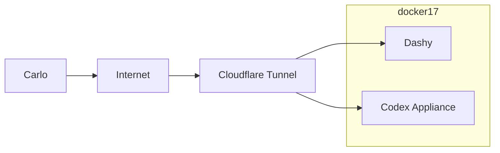
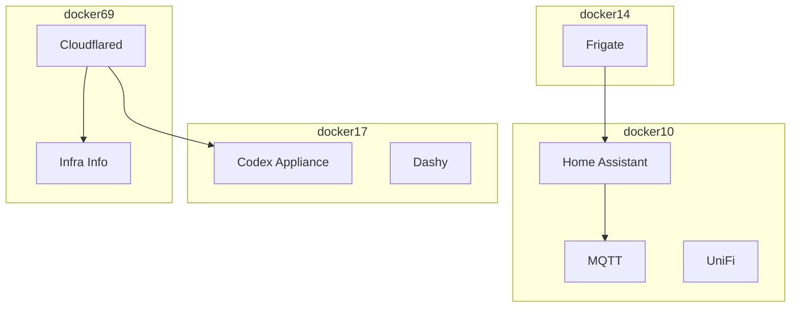
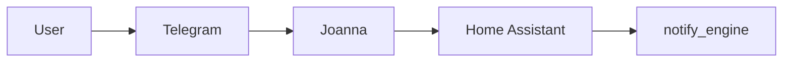

# Excalidraw Mermaid Playbook

Use this reference when you need a stable, reviewable architecture diagram artifact.

## Goal

Produce Mermaid that:

- is easy to diff in git
- is readable in markdown or issue comments
- imports into Excalidraw without heavy cleanup

## Recommended Views

### Context diagram

Use when the audience only needs major boundaries.

### Deployment diagram

Use when the audience needs host and service placement.

### Flow diagram

Use when the audience cares about one path, not the full estate.

## Label Rules

- Prefer `docker17` over raw IP addresses.
- Prefer `Cloudflare Tunnel` over product-internal nouns unless the audience already knows them.
- Keep labels human-readable; IDs belong in notes, not in node titles.

## Edge Rules

- Use unlabeled arrows for obvious containment or traffic.
- Add short labels only when they matter:
  - `RTSP`
  - `MQTT`
  - `HTTPS`
  - `Webhook`
  - `8124`

## Split Rules

Split into multiple diagrams when any of these are true:

- more than four hosts
- more than 15 nodes
- mixed audiences (operators vs app users)
- both runtime placement and request flow are important

Good split example:

- diagram 1: public edge and user entry points
- diagram 2: host/container placement

## Excalidraw Guardrails

Avoid these Mermaid features in Excalidraw-bound artifacts:

- non-flowchart diagram types
- expanded shape syntax (`@{ ... }`)
- CSS classes or class attachments
- inline style directives
- HTML inside labels
- click handlers

If you want polish, do it after import inside Excalidraw.

## File Naming

Prefer short, obvious filenames:

- `docs/diagrams/bear-stone-context.mmd`
- `docs/diagrams/docker-host-topology.mmd`
- `docs/diagrams/cloudflare-edge-flow.mmd`

## Review Checklist

- Does the diagram answer one question clearly?
- Are host boundaries obvious?
- Are public entry points distinguishable from LAN-only services?
- Is the artifact still readable as raw Mermaid text?
- Will Excalidraw import it without advanced Mermaid features?
